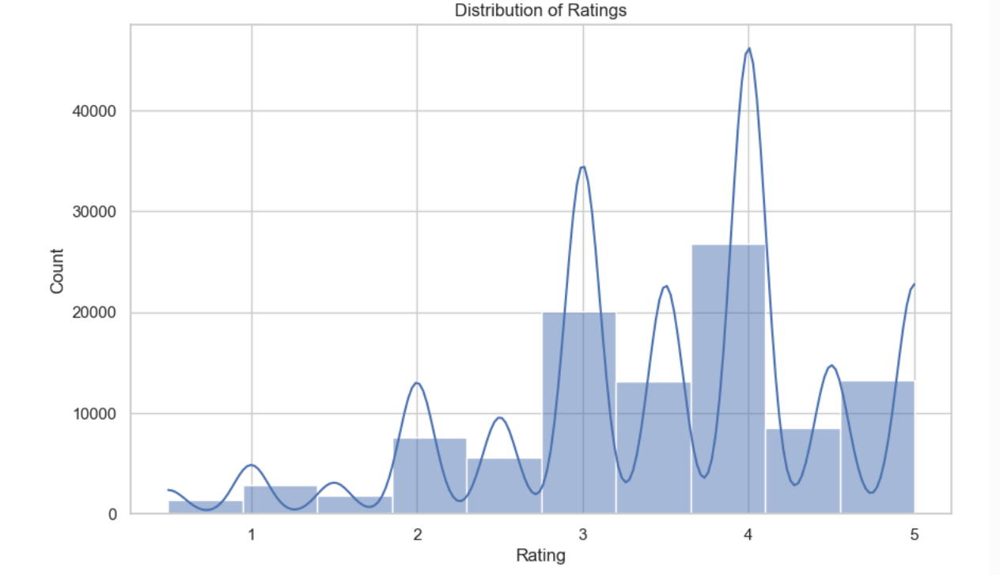
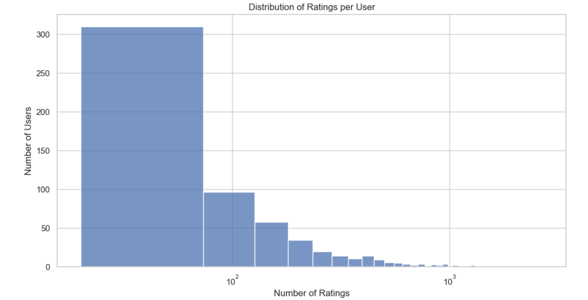
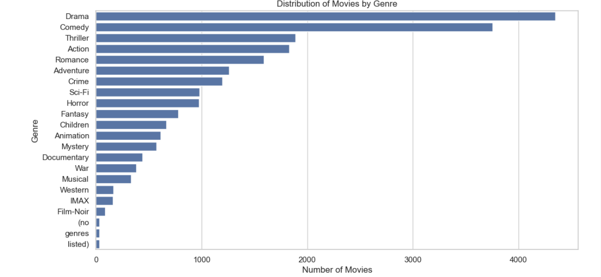
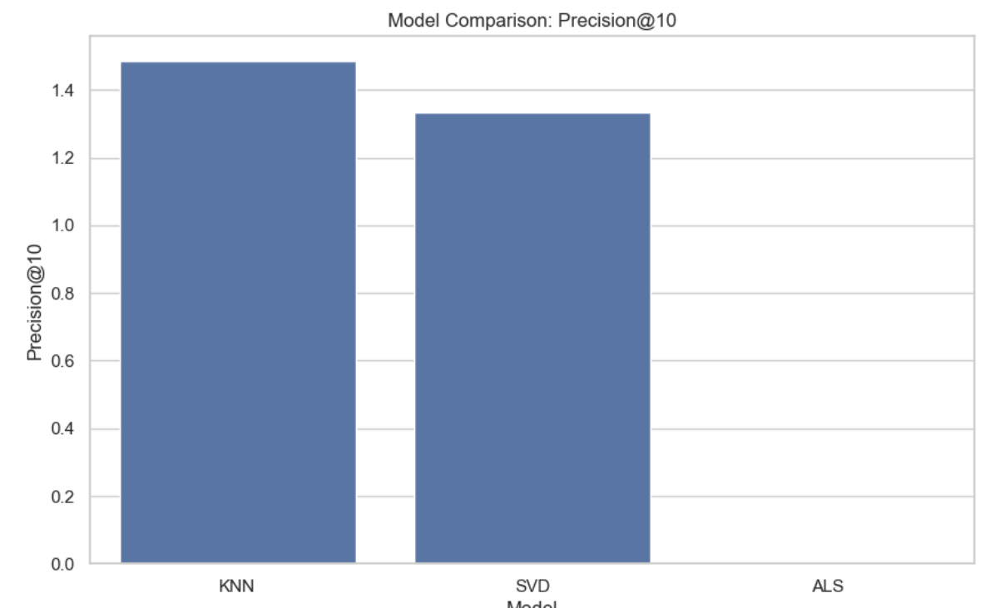
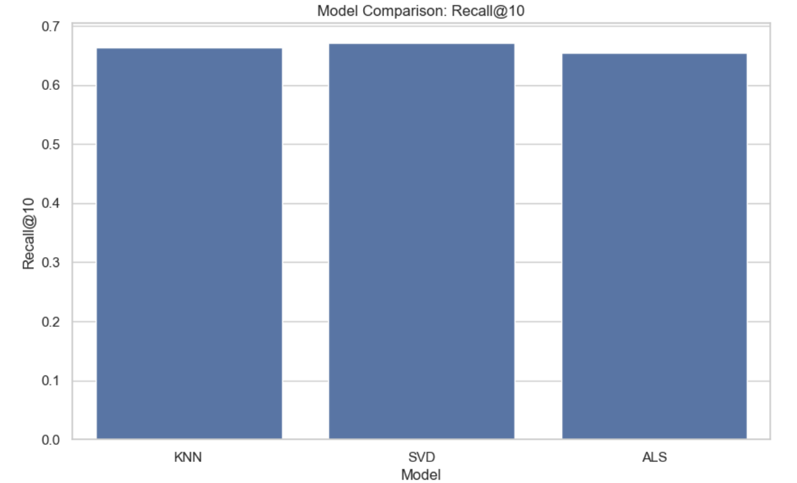

# Recommendation Systems Project

## 📄 Project Description

In today’s crowded streaming landscape, users face decision fatigue due to the overwhelming number of available titles. This often leads to reduced watch time and increased churn. To address this, the project aims to build a personalized movie recommendation system using the MovieLens dataset. By analyzing user ratings and preferences, the system will deliver the top five movie suggestions tailored to individual tastes.

The goal is to enhance user satisfaction and retention by surfacing relevant content that resonates with each viewer. This solution will serve key stakeholders including:

- 🎯 Product Team
- 📊 Data Scientists
- 📣 Marketing Teams
- 🎥 Streaming Platform Owners

The recommendation engine will leverage collaborative filtering techniques to uncover latent user preferences. Success will be measured through:

- ✅ **RMSE/MAE** – for rating prediction accuracy
- ✅ **Precision, Recall, F1 Score** – for ranking quality
- ✅ **Coverage & Diversity** – for recommendation variety and system robustness
- ✅ **User Engagement Metrics** – to assess impact on satisfaction and retention
- ✅ **Actionable Insights** – for product and marketing teams
- ✅ **Visualizations** – to communicate results to non-technical stakeholders

The central question guiding this project is:

> **"How can we deliver personalized movie recommendations that will ultimately increase user satisfaction and retention on a streaming platform?"**

## Data Understanding
The project used the dataset, comprising four CSV files: 
- **links.csv**
- **movies.csv**
- **ratings.csv**
- **tags.csv**

The 4 datasets offer a comprehensive foundation for a robust movie recommendation system.

### Movies.csv
Structure

- **Rows: 9,742**
- **Columns: movieId, title, genres**
Purpose
Contains metadata about movies.
Genres are useful for:
**Content-based filtering (e.g., recommending similar genre movies)**
- Genre-specific recommendations**
- Enriching user profiles with genre preferences**

### Ratings Dataset
Structure
- **Rows: 100,836**
- **Columns: userId, movieId, rating, timestamp**
Purpose
**Core dataset for collaborative filtering.**
Enables:
- User-item interaction modeling**
- Predicting ratings for unseen movies**
- Building user-user or item-item similarity matrices**

### Links Dataset
Structure
- **Rows: 9,742**
- **Columns: movieId, imdbId, tmdbId**
Purpose
**Serves as a bridge to external metadat sources by mapping internal movieId to external databases (IMDb, TMDb).**
Useful for:
- Enriching movie metadata (e.g., posters, cast, reviews)**
- Integrating with external APIs**
- Improving user experience with richer content**

### Tags dataset
Structure
- **Rows: 3,683**
- **Columns: userId, movieId, tag, timestamp**
Purpose
**Captures user-generated tags for movies.**
Tags provide semantic context (e.g., “funny”, “dark comedy”, “Will Ferrell”) that can be used to:
- Enhance content-based filtering**
- Profile user preferences**
- Enable tag-based search**
- Cluster movies by themes or genres**

## Data Preprocessing
1. *Merging*: The 4 datasets were merged to create one dataframe that will be used for analysis. the final dataframe had 102,677 rows and 10 columns. 
2. *Dropping colums not in use*: Columns that would not be used during the modeling were dropped. These included 'tag', 'timestamp'
3. *Handling of missing values*: Any rows that had missing values in  'userId', 'movieId', 'rating', 'title', 'genres' was dropped. while any missing value in 'imdbId' 'tmdbId' and 'timestamp_x' were filled with 0
4. *Removal of duplicates* all duplicates were dropped. 
5. *Fix inconsistencies*: This was done to ensure consistency in the datatypes. 
6. *Scaling*: A scaler was applied to normalise numerical features such as 'ratings'
7. *One-hot encoding*: This was done to create binary features 

## Visualizations
### Rating Distribution

Shows user rating behavior, with a bias toward higher ratings.

### User Activity

Displays number of ratings per user, highlighting active vs. passive users.

### Genre Distribution

Breakdown of movie genres, showing dominance of Drama and Comedy.

## Modeling Techniques
Implemented and tuned three recommendation models:
- **KNN (Collaborative Filtering)**: Based on user similarity
- **SVD (Matrix Factorization)**: Captures latent features and biases
- **ALS (Implicit Feedback)**: Optimized for sparse matrices

## Evaluation Metrics
- **RMSE**: Measures rating prediction accuracy
- **Precision & Recall**: Evaluate relevance of top-N recommendations

### Model Performance Comparison
#### RMSE

#### Precision

#### Recall

## Key Findings
- **SVD** outperformed other models with lowest RMSE and highest precision/recall.
- **KNN** and **ALS** showed moderate performance.
- **Cold Start** and **Sparsity** issues affected ALS and KNN.

## Recommendations
- Use SVD for personalized recommendations
- Consider hybrid models to address cold start
- Optimize hyperparameter tuning for scalability
- Enrich metadata using external sources via `links.csv`

## Future Work
- Integrate deep learning models for hybrid recommendations
- Explore temporal dynamics using timestamps
- Add user demographics for enhanced personalization
- Deploy model as an API for real-time recommendations

## Contributors
1. Hezron Rumenya
2. Eric Metobo
3. Joackim Kisienya
4. Joy Sila
5. Lynn Kyalo
6. Newton Njeri
